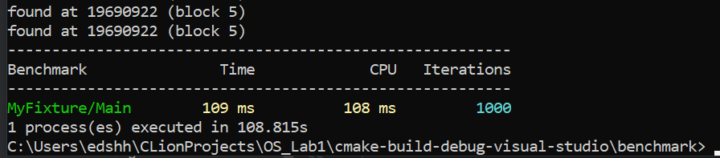

# Лабораторная работа #1 по ОС
## Отчёт

* Выполнил: Щербинин Эдуард Павлович, P3314
* Преподаватель: Рогачев Михаил Сергеевич
* Вариант: `Windows CreateProcess ema-search-int dedup`

## Часть 1. Запуск программ

Необходимо реализовать собственную оболочку командной строки - shell.

Реализация оболочки выполнена в модуле [WinShell](source/WinShell).
Оболочка имеет текущую дерикторию, в которой находится пользователь и позволяет запускать приложения отностельно текущего пути, а также системные приложения.

Также поддерживаются кастомные команды:
* `exit` - выйти из командной строки
* `cd {dir}` - перейти в директорию dir относительно текущей дериктории
* `dir` - вывести список всех файлов и дерикторий в текущей дериктории
* `tms {n}` - установить количество n создаваемых процессов при его запуске (по умолчанию 1), необходимо для запуска нагрузчиков несколькими процессами одновременно

## Часть 2. Мониторинг и профилирование

Разработать комплекс программ-нагрузчиков по варианту, заданному преподавателем.

* Реализация `ema-search-int` (поиск элемента во внешней памяти): [EmaSearchInt.cpp](benchmark/WinShell/EmaSearchInt.cpp)
* Реализация `dedup` (дедупликация элементов массива): [Dedup.cpp](benchmark/WinShell/Dedup.cpp)

Количество повторений алгоритма [библиотека](https://github.com/google/benchmark) определяет автоматически,
однако можно задать вручную с помощью аргумента `--benchmark_min_time=Nx`, где N - кол-во повторений.

Программы скомпилированы без оптимизаций (компилятор MSVC): `add_compile_options(/Od)`

### Оценка

Попробуем оценить время работы алгоритмов:

* `ema-search-int` Ищет случайно расположенный элемент типа int64 в файле размером 256Mb (2^25 элементов).
Предположим, элемент расположился по середине и нам нужно перебрать 2^24 элементов.
Проверка элемента занимает ~10 asm инструкций, учитывая частоту процессора в 4 GHz, получаем примерно 400M эл/сек.
`2^24 / 400M = 0.042 с = 42 мс`. Так как чтение файла происходит блоками по 32Mb, в среднем мы будем прочитывать половину файла: 128Mb.
Учитывая скорость SSD в ~3000 Mb/s: `128 / 3000 = 43 мс` уйдёт на чтение файла. Итого, оценка времени: `42 + 43 = 85 мс`
* `dedup` Проводит дедупликацию элементов массива со сложностью O(N), используя `unordered_set`.
Учитывая количество элементов (2^23), более сложный алгоритм (~50 asm инструкций) и частоту 4 GHz, получим 80M эл/сек.
Итого, оценка: `2^23 / 80M = 105 мс`

### Запуск и метрики

Будем использовать Process Explorer от SysInternals для анализа

#### ema-search-int

Запустим нагрузчик с 1000 итераций:

Как видно, одна итерация заняла около 100 мс, близко к рассчитаному.

Посмотрим на метрики:

Видно, что программа занимает всего чуть больше 6% процессорного времени, остальное в Idle.
Это связано с тем, что в процессоре 16 виртуальных ядер (8 физических), и однопоточный нагрузчик нагружает одно ядро: `100% / 16 = 6.25%` / ядро.
Памяти процесс занимает, как и ожидалось, 32Mb.

Переключимся на мониторинг CPU и убедимся в этом:

Как и ожидалось, процесс почти полностью занял логическое ядро.

Посмотрим нагрузку I/O:

Как видно, процесс не полностью задействует диск, и читает в среднем 1.6 Gb/s (50% от максимальной скорости диска).
Половина времени действительно уходит на обработку данных CPU.

Попробуем найти эффективное количество нагрузчиков.
На машине 8 физических ядер.
Попробуем запустить 4 процесса, в теории время выполнения не должно увеличться, так как все 4 ядра будут работать:

Здесь немного интереснее, ОС разделила процессы на несколько логических ядер.
CS почти не изменилось (30k), процессорного времени всё еще достаточно

С другой стороны, они всё равно занимают около 6% CPU.

Посмотрим на время выполнения:

Оно выросло почти в 2 раза.

Кажется, SSD перестал справляться:

3.6 Gb/s, максимальная скорость диска.
Для работы одного нагрузчика требовалось 1.6 Gb/s, или 6.4 для 4-х, от сюда падение скорости.

Кажется, оптимальное количество нагрузчиков для данного алгоритма: 2. Далее скорости SSD становится недостаточно.

Однако, время выполнения всё равно больше (132 против 108 мс), и диск загружен на 2.5 Gb/s (а не на 3.2).
Похоже, часть времени уходит на ожидание одним из процессов диска, когда он читает для другого.

Таким образом, сколько бы мы не запускали нагрузчиков, упор данного алгоритма всегда в диск.
Далее перейдём к алгоритму, который не задействует диск.

#### dedup

Запустим нагрузчик:

Одна итерация заняла 5.4 с, что сильно больше рассчитанных 100 мс..
По видимому, алгоритм на одно значение тратит сильно больше 50 asm инструкций (вставка в большой set, рост vector'а,  и тд).

Процесс полностью занимает ядро.

Увеличим количество процессов до 4:

Процессы заняли 4 ядра и выполнились даже быстрее (возможно, из за разгона процессора под нагрузкой).
Заметим малое количество контекст свичей CS (~200) (ресурсов достаточно для других процессов).

Увеличим количество процессов до 8 (= физических ядер):

Процессы заняли равномерно 8 ядер, однако выполнились немного медленне за счёт физической занятости ядер другими процессами.
CS вырос некритично (~500) благодаря виртуальным ядрам процессора, на которых находятся другие процессы.

Увеличим количество процессов до 16 (= виртуальных ядер):

Процессы заняли все 16 виртуальных ядер и выполнились примерно в 2 раза медленнее (тк физических ядер в 2 раза меньше).
Видно как сильно вырос CS (до ~8k), т.к. все логические ядра теперь заняты и приходится менять контекст для других процессов.

Увеличим количество процессов до 32 (x2 виртуальных ядер):

Теперь процессы выполнились еще за в 2 раза большее время, однако процессорного времени заняли столько же (на виртуальных процессорах одновременно находились 16 процессов).
CS вырос еще сильнее (до ~12k), т.к. теперь смена контекста нужна им самим для параллельной работы.

Попробуем вместо создания множества процессов, создать один процесс с несколькими потоками.

Запустим с 16 потоками: `Threads(16);`

Видно, как большинство потоков в состоянии Running, однако некоторые вытеснены другими процессами и ожидают.
Интересно, как сильно выросло количество контекст свичей (>5M) и CS Delta у CPU до 640k.
Похоже, из-за этого эффективность сильно упала и одна итерация выполнилась за целых 184 с (вместо 10)!

Данный феномен могу объяснить изолированностью процессов в Windows, при запуске процессов каждый имеет собственную память и контекст.
С другой стороны, когда 16 потоков запущены в одном процессе, они конкурируют за общие ресурсы, память, кэш, что увеличивает CS.
Планировщик Windows может более эффективно управлять независимыми процессами, чем потоками внутри одного процесса.
В конце концов, **потоки внутри процесса имеют одинаковый приоритет**, из за чего пытаются отработать одинаковые кванты времени и переключаются намного чаще.

В конце, вернём один поток в процессе и попробуем скомпилировать программу с максимальными (для MSVC) оптимизациями: `add_compile_options(/O2)`

Время выполнения снизилось в 3 раза (до 1.7 с) за счёт агрессивных оптимизаций.

## Вывод

В ходе выполнения лабораторной работы я научился работать с Windows API, создавать с её помощью дочерние процессы.
Также я реализовал программы-нагрузчики и собрал метрики от их использования.
Я постарался предсказать время выполнения программы и в 1/2 случаев оказлся прав.
Я попробовал запускать несколько процессов с нагрузчиками, и результаты получились ожидаемы, однако когда я запустил один процесс с несколькими потоками, результат оказался очень неожиданным:
планировщик Windows работает намного эффективнее с множеством процессов в одном потоке, чем с одним процессом с множеством потоков.
Полученные знания пригодятся мне при разработке приложений под Windows на низкоуровневых языках.
